# Katya Katya (Memory Game Revival)

Este proyecto representa la evolución del clásico juego de memoria (*Memory Game Revival*), integrándolo ahora como un minijuego fundamental que alimenta un ciclo completo de progresión narrativa y citas. Desarrollado con **Avalonia UI** para el cliente multiplataforma y un backend robusto en **ASP.NET Core**.

---

## Galería de Capturas de Pantalla (Showcase)

A continuación se presentan capturas de pantalla reales de la interfaz del juego, destacando su diseño estético limpio, acogedor y su gran nivel de detalle:

### Pantalla Principal y Acceso

| Menú Principal | Pantalla de Login / Registro |
| :-: | :-: |
| 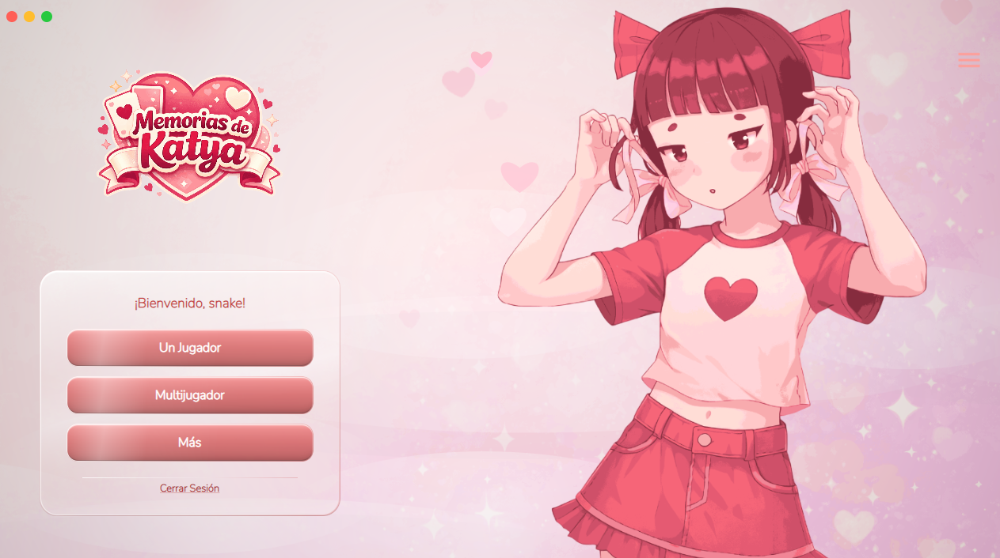 | 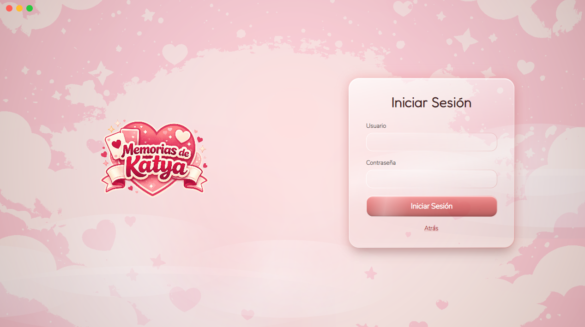 |

### Jugabilidad y Minijuegos

| Selección de Tableros | Tablero Multijugador |
| :-: | :-: |
| 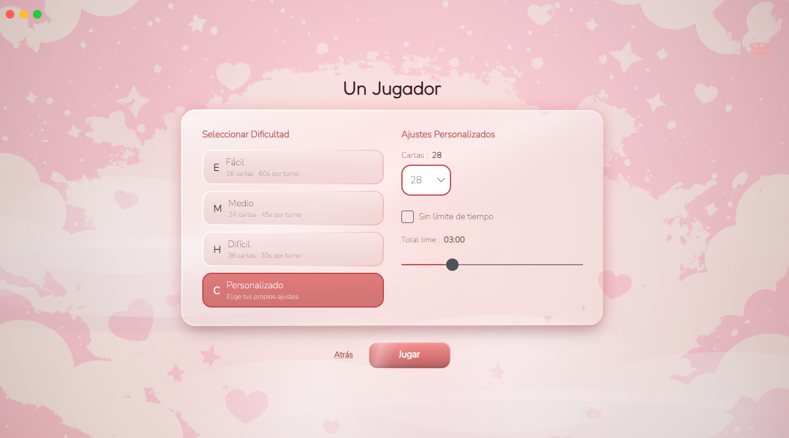 | 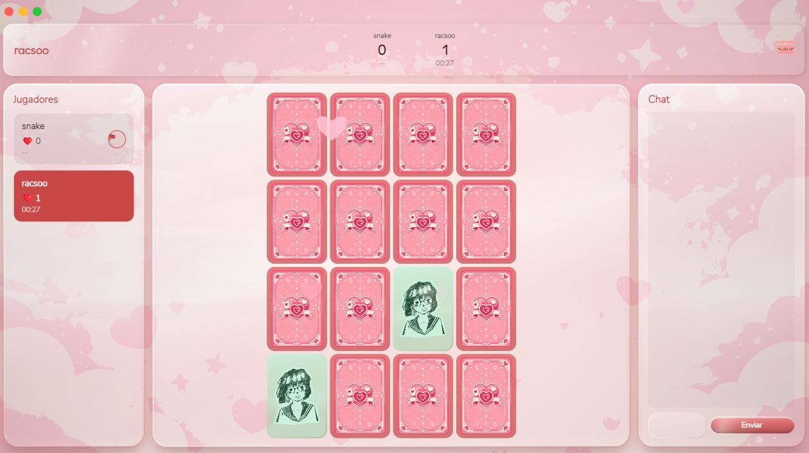 |

### Galería y Colección de Cartas

| Álbum / Galería de Cartas | Boceto de la Galería |
| :-: | :-: |
| 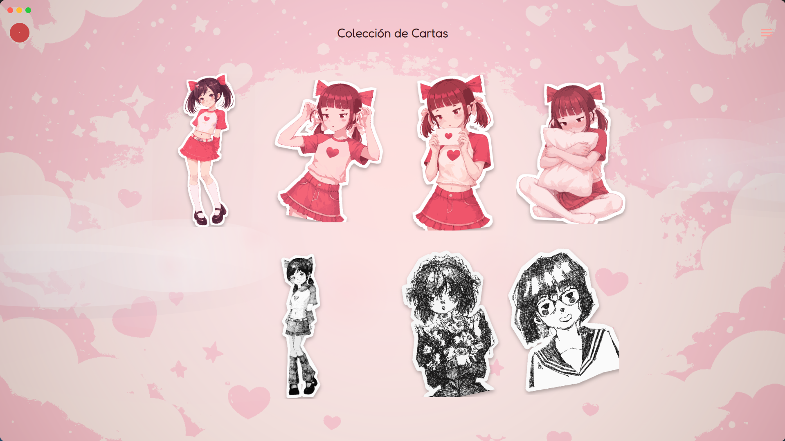 | 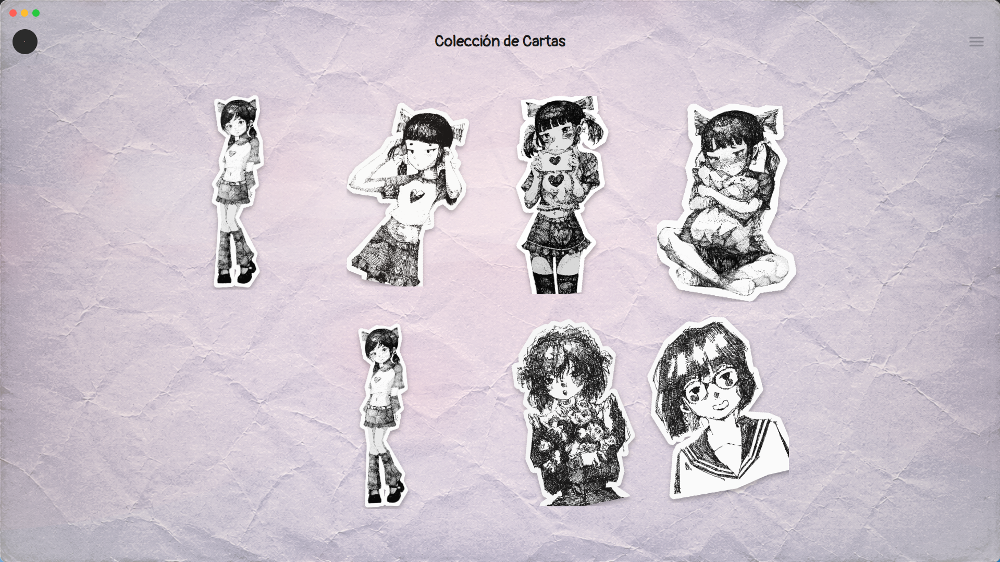 |

### Perfil del Jugador y Historial

| Estadísticas de Perfil | Historial de Partidas |
| :-: | :-: |
| 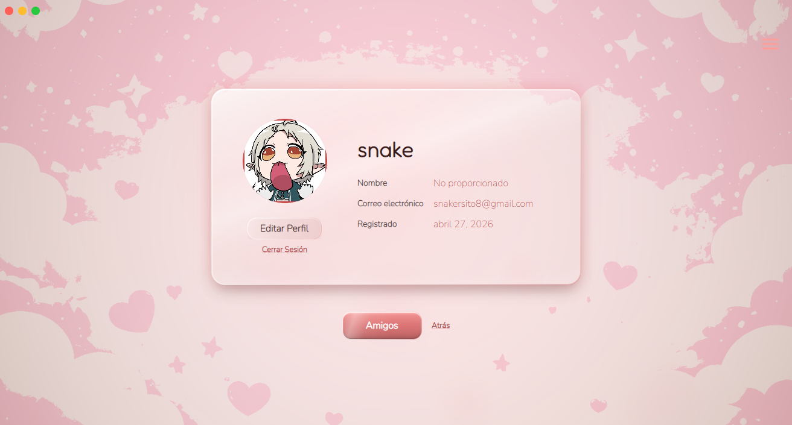 | 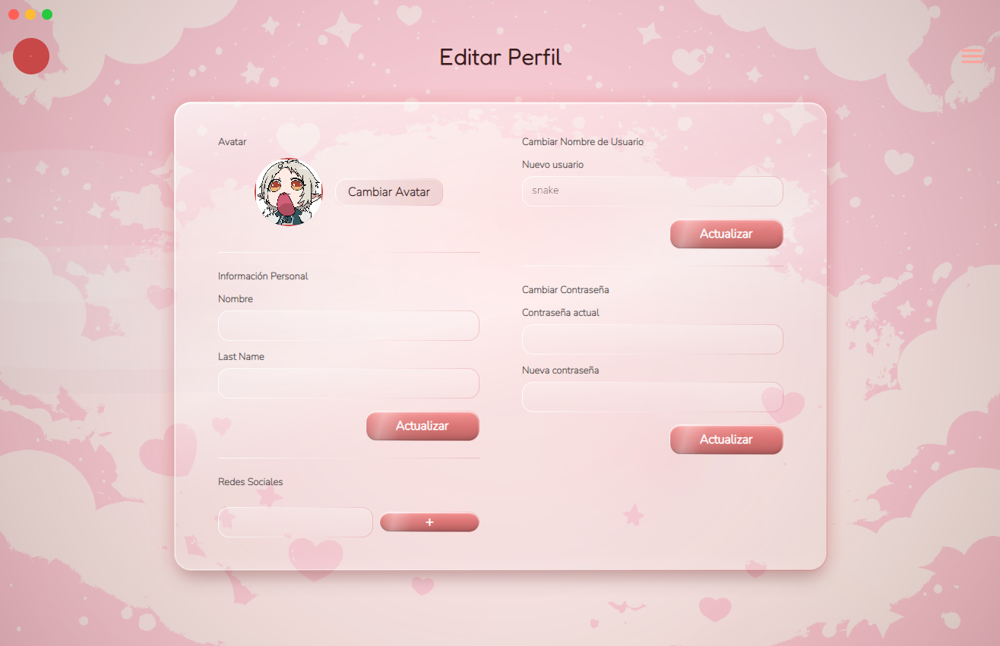 |

### Configuración, Temas y Localización

| Configuración General | Selección de Temas Visuales | Localización e Idiomas |
| :-: | :-: | :-: |
| 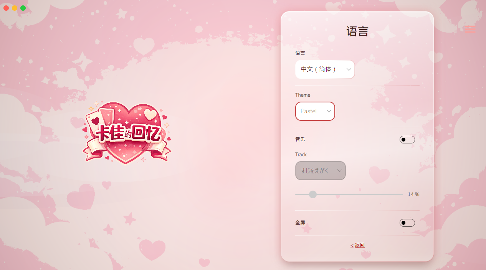 | 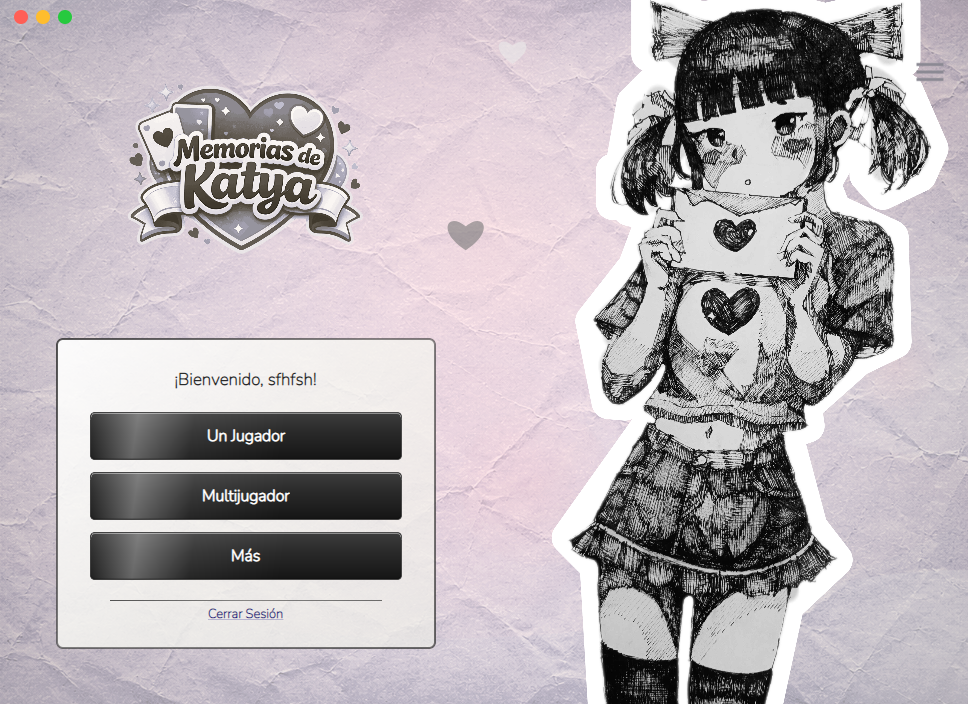 | 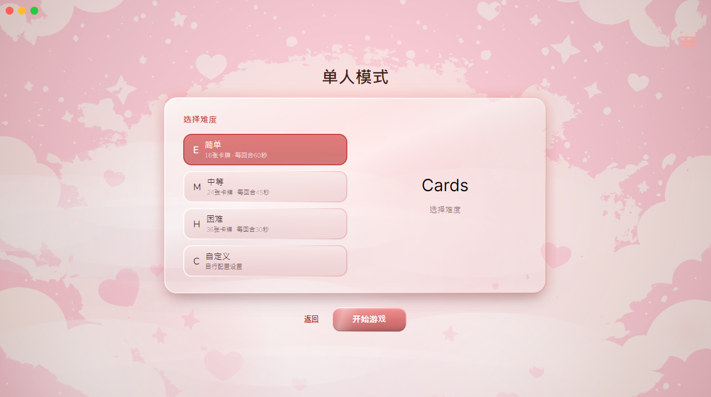 |

---

## Características Principales

* **Ciclo de Citas & Novela Visual (Dating Hub):** Interactúa con Katya y otros personajes, desbloquea diálogos, regala obsequios y aumenta tu nivel de afinidad.
* **Minijuego de Memoria:** Modos de juego solitario y multijugador para ganar monedas, obtener multiplicadores por rachas y desbloquear contenido exclusivo.
* **Salas Multijugador en Tiempo Real:** Gestión de lobbies y salas de juego en tiempo real utilizando **SignalR**.
* **Colección de Ilustraciones (Galería):** Colecciona cartas con ilustraciones estilo *hand-drawn* únicas a medida que avanzas en el juego.
* **Personalización Visual (Temas):** Adapta la interfaz a tu estilo con temas de alta calidad integrados.
* **Soporte Multilingüe (i18n):** Traducido completamente al español (es-MX), inglés (en-US), japonés (ja-JP), chino simplificado (zh-CN) y coreano (ko-KR).
* **Estadísticas de Perfil:** Rastrea tu progreso personal, partidas ganadas, monedas acumuladas y cartas desbloqueadas.

---

## Arquitectura y Tecnologías

El proyecto sigue una arquitectura desacoplada moderna:

### Cliente (Frontend)

* **Framework:** [Avalonia UI](https://avaloniaui.net/) (.NET 9 / .NET 10) - Cliente de escritorio multiplataforma (Windows, Linux y macOS).
* **Patrón:** MVVM con [CommunityToolkit.Mvvm](https://learn.microsoft.com/en-us/dotnet/communitytoolkit/mvvm/).
* **Motor de Renderizado:** Skia para fondos animados, partículas atmosféricas y transiciones fluidas de expresiones.
* **Audio:** Efectos de sonido (SFX) y música ambiental responsiva.

### Servidor (Backend)

* **Framework:** ASP.NET Core Web API (.NET 10).
* **Tiempo Real:** SignalR para sincronización multijugador y presencia en tiempo real.
* **Base de Datos:** PostgreSQL 17 + Entity Framework Core (Migraciones Code-First).
* **Seguridad:** Autenticación JWT y sistema de verificación de cuentas por correo electrónico (SMTP).

---

## Inicio Rápido y Configuración

Puedes ver las instrucciones detalladas de configuración en:

* [Guía de Configuración en Español (docs/SETUP_ES.md)](docs/SETUP_ES.md)
* [English Setup Guide (docs/SETUP_EN.md)](docs/SETUP_EN.md)

### Resumen de Pasos para iniciar localmente

1. **Clonar el repositorio:**

    ```bash
    git clone https://github.com/tu-usuario/MemoryGame-Revival.git
    cd MemoryGame-Revival
    ```

2. **Configurar variables de entorno:**
    Copia el archivo de variables de entorno de ejemplo y rellena tus datos:

    ```bash
    cp .env.example .env
    ```

3. **Iniciar Base de Datos y API Server (vía Docker):**

    ```bash
    docker-compose up -d
    ```

4. **Ejecutar el Cliente:**
    Abre `KatyaKatya.Client/KatyaKatya.slnx` en tu IDE (Visual Studio, Rider) o corre el comando:

    ```bash
    cd KatyaKatya.Client/KatyaKatya.Client
    dotnet run
    ```

---

## Licencia

Este proyecto forma parte de un trabajo académico. Todos los derechos sobre las ilustraciones y recursos del juego pertenecen a sus respectivos autores.
